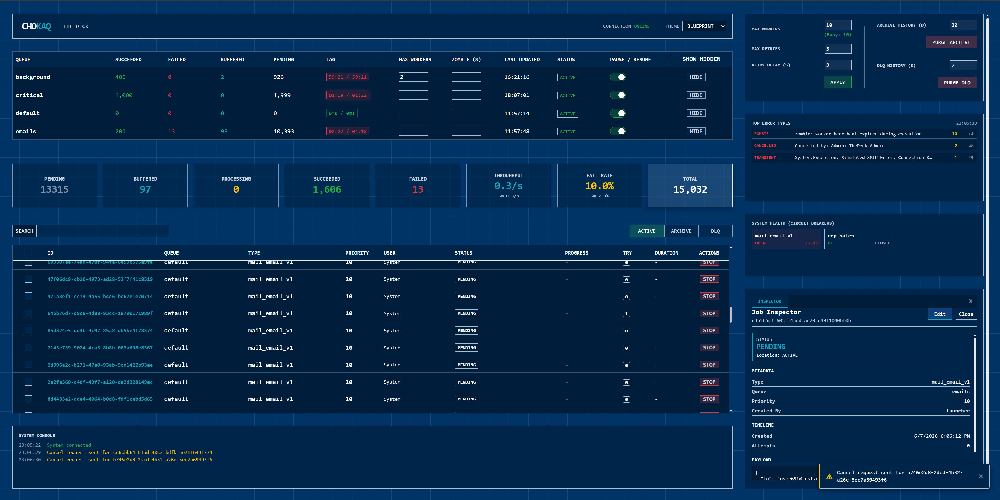
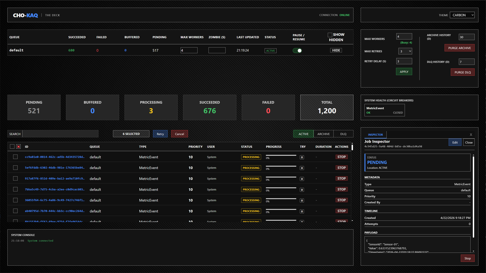

# ChokaQ


**Current Status:** Work in Progress / Proof of Concept

**ChokaQ** is an enterprise-grade background job framework designed for high-load environments where reliability and minimal dependency footprint are critical. It bridges the gap between simple in-memory channels and heavy message brokers, offering atomic reliability backed by a robust Three Pillars storage architecture using SQL Server, completely avoiding the overhead of Entity Framework or any other third-party ORM.




---

## Strategic Architecture

ChokaQ implements a **2x2 matrix architecture**, allowing developers to choose between volatile memory for speed and persistent SQL storage for reliability, combined with either typed Bus processing or raw Pipe processing.

### Processing Modes
1.  **Bus Mode:** Strongly typed jobs with dedicated handlers, Dependency Injection scopes, and profiles. Best for complex business logic.
2.  **Pipe Mode:** High-throughput processing of raw payloads via a single global handler. Best for telemetry, logs, and event streams.


### Storage Modes
1.  **In-Memory:** Zero-config RAM storage using System.Threading.Channels.
2.  **SQL Server:** Persistent storage using a custom lightweight ADO.NET wrapper (SqlMapper).

---

## Data Architecture: The Three Pillars

To guarantee consistent performance regardless of historical data volume, data is physically separated into three atomic tiers:

1.  **JobsHot (Active):**
    * Stores only Pending, Fetched, and Processing jobs.
    * Uses row-level locking (UPDLOCK, READPAST) for high-concurrency fetching without deadlocks.

2.  **JobsArchive (History):**
    * Stores successfully completed jobs.
    * Uses SQL Page Compression.
    * Optimized for analytical filtering (Date, Queue, Type).

3.  **JobsDLQ (Dead Letter Queue):**
    * Stores failed (MaxRetriesExceeded), cancelled, or zombie jobs.
    * Supports manual payload editing and resurrection.


---

## Technical Capabilities

### Core Engine
* **True Zero-Dependency:** The Core library depends only on standard Microsoft.Extensions abstractions. The engine does not rely on third-party libraries (uses native `Microsoft.Data.SqlClient`), avoiding transitive dependency bloat and simplifying long-term maintenance.
* **Near-Native Execution:** Performance-optimized job dispatching using cached compiled Expression Trees, completely eliminating the overhead of standard reflection.
* **Atomic State Transitions:** All lifecycle events use SQL transactions with the `OUTPUT` clause to ensure data is never lost during movement between Hot, Archive, and DLQ tables.

### Concurrency
* **Elastic Concurrency:** The number of active workers can be scaled up or down at runtime via the dashboard without restarting the application (implemented via `ElasticSemaphore`).
* **Bulkhead Isolation:** Advanced queue management that prevents the "noisy neighbor" problem. By enforcing concurrency limits at the database level, the system ensures that resource-intensive tasks do not stall high-priority, lightweight operations.
* **Prefetching:** Workers use an internal bounded channel to buffer jobs from SQL, decoupling database latency from processing throughput.

### Resilience & Reliability
* **Smart Worker Logic:** Intelligent failure handling that distinguishes between transient and fatal errors. Non-transient exceptions bypass retry policies and are routed to the DLQ immediately to preserve system resources and provide instant visibility into code defects.
* **Circuit Breaker:** In-memory protection that tracks failure rates per Job Type. Automatically opens the circuit to block execution of failing job types, preventing cascading system failures.
* **Zombie Rescue:** Built-in self-healing mechanisms via a background service (`ZombieRescueService`) that monitors heartbeats. Automatically recovers abandoned or "zombie" jobs, ensuring no task is lost due to process crashes or network instability.
* **Smart Retries:** Configurable exponential backoff strategies with jitter to prevent "thundering herd" effects on external services.
* **Idempotency:** Built-in support for idempotency keys to prevent duplicate job processing.

### "The Deck" (Dashboard)
A reactive administrative dashboard built with **Blazor Server** and **SignalR**. It features real-time job monitoring, swappable visual themes, and specialized tools for operational management.

* **Visual Themes:** Includes two built-in themes: **Blueprint** (Engineering Blue) for clarity and **Carbon** (High-Contrast Dark) for low-light environments.
* **Queue Management:** Queues can be paused, resumed, or deactivated at runtime. Changes propagate immediately to all workers via the database.
* **Live Matrix:** Virtualized grid for active jobs.
* **Ops Panel:**
    * **Inspector:** View full job details and exception stack traces.
    * **Administrative Control (Hot-Edit & Resurrect):** Modify job payloads or tags directly within the Dead Letter Queue to fix data-driven failures and restart execution immediately, eliminating the need for manual database scripts or job re-enqueuing.
    * **History Filter:** Server-side filtering of the Archive table.
* **Bulk Actions:** Retry, Cancel, or Purge jobs in batches.
* **Circuits View:** Monitor the state (Closed/Open/HalfOpen) of all circuit breakers.
* **Console Stream:** System-wide events and logs are streamed directly to the browser console view.

---

## Observability (OpenTelemetry)

ChokaQ provides native, zero-dependency OpenTelemetry metrics using standard `System.Diagnostics.Metrics`. This means you can easily monitor throughput, failures, and execution latency without installing any heavy, proprietary telemetry packages in the library itself.

**Available Metrics (Meter: `ChokaQ`):**
* `chokaq.jobs.enqueued` (Counter) — Total jobs submitted.
* `chokaq.jobs.completed` (Counter) — Total jobs executed successfully.
* `chokaq.jobs.failed` (Counter) — Total jobs that threw an exception.
* `chokaq.jobs.processing_duration` (Histogram) — Time taken to process a job (in milliseconds).

*All metrics are automatically tagged with `queue` and `type`.*

### Exporting Metrics to Prometheus / Grafana
Since ChokaQ uses standard BCL components, simply configure OpenTelemetry in your host `Program.cs` and listen to the **"ChokaQ"** meter:

```csharp
// Requires package: OpenTelemetry.Exporter.Prometheus.AspNetCore
builder.Services.AddOpenTelemetry()
    .WithMetrics(metrics =>
    {
        metrics.AddMeter("ChokaQ"); // Listen to ChokaQ events
        metrics.AddPrometheusExporter();
    });

var app = builder.Build();

// Expose the /metrics endpoint
app.UseOpenTelemetryPrometheusScrapingEndpoint();
```

---

## Middleware Pipeline

ChokaQ supports an ASP.NET Core style Middleware Pipeline. You can intercept the execution of jobs to inject cross-cutting concerns like custom logging, validation, or correlation IDs without bloating your business logic.


### 1. Create a Middleware
Implement the `IChokaQMiddleware` interface. The `job` parameter will be your typed DTO in Bus Mode, or the raw JSON string in Pipe Mode.

```csharp
using ChokaQ.Abstractions.Contexts;
using ChokaQ.Abstractions.Middleware;

public class LoggingMiddleware : IChokaQMiddleware
{
    private readonly ILogger<LoggingMiddleware> _logger;
    public LoggingMiddleware(ILogger<LoggingMiddleware> logger) => _logger = logger;

    public async Task InvokeAsync(IJobContext context, object? job, JobDelegate next)
    {
        _logger.LogInformation("Job {JobId} starting...", context.JobId);
        
        // Pass control to the next middleware (or the final handler)
        await next();
        
        _logger.LogInformation("Job {JobId} finished successfully.", context.JobId);
    }
}
```

### 2. Register it
Middlewares are executed in the exact order they are registered.

```csharp
builder.Services.AddChokaQ(options =>
{
    options.AddProfile<MailingProfile>();
    
    // Will be executed first (outermost layer)
    options.AddMiddleware<LoggingMiddleware>(); 
});
```

---

## Security & Authorization

ChokaQ follows a **"Secure by Design / Inversion of Control"** philosophy. Instead of implementing its own authentication system or enforcing specific providers (like Identity or Entra ID), it leverages the standard **ASP.NET Core Authorization Policy** infrastructure.

You define *who* is an Admin in your host application, and ChokaQ respects it.

### Prerequisites
ChokaQ does **not** modify your middleware pipeline. You must ensure the standard ASP.NET Core middleware is registered in your `Program.cs` **before** calling `MapChokaQTheDeck()`:

```csharp
app.UseAuthentication(); // Required: populates HttpContext.User
app.UseAuthorization();  // Required: enforces [Authorize] policies

app.MapChokaQTheDeck();
```

### Enabling Security
To secure "The Deck" (Dashboard and SignalR Hub), simply provide the name of your authorization policy in the options.

```csharp
// 1. Define a Policy in your host app (Program.cs)
builder.Services.AddAuthorization(options =>
{
    options.AddPolicy("ChokaQAdmin", policy => 
        policy.RequireClaim("Role", "SystemAdministrator"));
});

// 2. Bind ChokaQ to this policy
builder.Services.AddChokaQTheDeck(options =>
{
    options.RoutePrefix = "/chokaq";
    
    // If set, ChokaQ will apply [Authorize(Policy = "ChokaQAdmin")] 
    // to all Dashboard and SignalR endpoints.
    options.AuthorizationPolicy = "ChokaQAdmin"; 
});
```

If `AuthorizationPolicy` is left `null` (default), no authorization is applied — the dashboard is publicly accessible.

---

## Quick Start (Source Integration)

Since ChokaQ is currently in development, integrate it by referencing the source projects directly.

### 1. Project References

Add references to the core libraries in your ASP.NET Core `.csproj` file:

```xml
<ItemGroup>
    <ProjectReference Include="..\src\ChokaQ.Core\ChokaQ.Core.csproj" />
    <ProjectReference Include="..\src\ChokaQ.Storage.SqlServer\ChokaQ.Storage.SqlServer.csproj" />
    <ProjectReference Include="..\src\ChokaQ.TheDeck\ChokaQ.TheDeck.csproj" />
</ItemGroup>
```

### 2. Configuration

**Program.cs**
```csharp
var builder = WebApplication.CreateBuilder(args);

// 1. Add ChokaQ Core & Profiles
builder.Services.AddChokaQ(options =>
{
    // Register Job Profiles (Bus Mode)
    options.AddProfile<MailingProfile>();
});

// 2. Add SQL Storage with Auto-Provisioning
// This will automatically create the 'chokaq' schema and tables on startup.
builder.Services.UseSqlServer(options =>
{
    options.ConnectionString = builder.Configuration.GetConnectionString("DefaultConnection");
    options.SchemaName = "chokaq"; 
    options.AutoCreateSqlTable = true;
});

// 3. Add Dashboard
builder.Services.AddChokaQTheDeck();

var app = builder.Build();

// 4. Map Dashboard Route
app.MapChokaQTheDeck(); // Default route: /chokaq

app.Run();
```

### 3. Define a Job & Handler

```csharp
// Job Contract (DTO)
public record SendEmailJob(string To) : ChokaQBaseJob;

// Job Handler
public class EmailHandler : IChokaQJobHandler<SendEmailJob>
{
    public async Task HandleAsync(SendEmailJob job, CancellationToken ct)
    {
        // Business logic here
        await Task.Delay(100);
    }
}

// Profile Registration
public class MailingProfile : ChokaQJobProfile
{
    public MailingProfile()
    {
        CreateJob<SendEmailJob, EmailHandler>("email_v1");
    }
}
```

### 4. Enqueue Job

```csharp
// Inject IChokaQQueue into your controller or service
await queue.EnqueueAsync(new SendEmailJob("user@example.com"), priority: 10);
```

---

## License

Copyright © 2026 Sergei Seivach

This project is licensed under the [Apache License 2.0](LICENSE).